# C/D. CIVICFLOW Relational Data Model (ERD)

The model is normalised to 3NF, with the exceptions marked **(snapshot)**, which are kept only for audit. The physical schema is the Flyway migration [`backend/src/main/resources/db/migration/V1__schema.sql`](../../backend/src/main/resources/db/migration/V1__schema.sql), and the JPA entities live in `backend/src/main/java/com/civicflow/domain`. The model, the migration and the entities must stay in sync (constitution Art. II.4).

Conventions: `id` is the surrogate PK (UUID/string). `*_id` columns are FKs. `created_at`/`updated_at` are implied on every table unless listed. Money is `decimal(14,2)` in ZAR. Enums are listed in §3.

---

## 1. Entities

### 1.1 Organisation & access

**Department**: an organisational unit that owns needs and a budget.
| Column | Type | Notes |
| --- | --- | --- |
| id | PK | |
| code | varchar UK | e.g. `ENV` |
| name | varchar | Environmental Services |
| municipality, province | varchar | |
| budget_allocated | decimal | Current financial-year allocation |
| financial_year | varchar | `2026/27` |
Relationships: 1 Department → 0..* AppUser, 0..* PublicNeed.

**AppUser**: a person using the platform, with exactly one role.
| Column | Type | Notes |
| --- | --- | --- |
| id | PK | |
| full_name, email (UK), title | varchar | |
| role | enum `UserRole` | |
| department_id | FK → Department, nullable | Department staff |
| provider_id | FK → Provider, nullable | Provider representatives |
| is_active | bool | |
Check: `role = PROVIDER ⇔ provider_id IS NOT NULL`.

**BusinessRuleSet**: the versioned, configurable organisational rules (BR-01…BR-20).
| Column | Type | Notes |
| --- | --- | --- |
| id | PK | |
| version | int UK | Incremented on each change |
| effective_from | timestamp | |
| approval_sla_hours | int | BR-01 (48) |
| budget_mode | enum `BLOCK`/`WARN` | BR-03 |
| quotation_threshold, min_competitive_offers | decimal, int | BR-04 (10 000, 3) |
| deviation_min_chars | int | BR-05 (20) |
| closing_soon_days | int | BR-12 (7) |
| impact_on_track_pct | int | BR-15 (50) |
| escalation_role | enum `UserRole` | BR-16 |
| bbbee_score_table, local_score_table, default_criteria | json | BR-17, BR-18, BR-20 |
| updated_by | FK → AppUser | |
Relationships: 1 BusinessRuleSet → 1..* ApprovalRule; 1 → 0..* PurchaseRequest (the version applied).

**ApprovalRule**: one threshold band (BR-02).
| Column | Type | Notes |
| --- | --- | --- |
| id | PK | |
| rule_set_id | FK → BusinessRuleSet | |
| min_amount, max_amount | decimal (max nullable = ∞) | Band `[min, max)`; see the boundaries in §4 |
| approver_roles | json (ordered `UserRole[]`) | Empty = auto-approve |

### 1.2 Need & approval

**PublicNeed**: the problem the organisation wants solved. It's the root of the lifecycle.
| Column | Type | Notes |
| --- | --- | --- |
| id | PK | |
| reference | varchar UK | `NEED-2026-014` |
| department_id | FK → Department | |
| created_by | FK → AppUser | |
| title, problem_statement, desired_outcome | text | |
| category | enum `NeedCategory` | Drives the metric templates |
| priority | enum `LOW`/`MEDIUM`/`HIGH`/`CRITICAL` | |
| estimated_budget | decimal | |
| required_capabilities | json `string[]` | |
| province, municipality, ward, latitude, longitude | geo | Where the problem is |
| status | enum `NeedStatus` | `DRAFT`, `OPEN`, `CLOSED`, `CANCELLED` |
Derived (not stored): **lifecycle stage**.

**PurchaseRequest**: the internal financial and approval instrument for a need.
| Column | Type | Notes |
| --- | --- | --- |
| id | PK | |
| reference | varchar UK | `PR-2026-031` |
| need_id | FK → PublicNeed **UK** | One request per need |
| requested_by | FK → AppUser | |
| rule_set_id | FK → BusinessRuleSet | Rules version applied |
| amount | decimal | |
| justification | text | |
| sourcing_method | enum `QUOTATION`/`OPEN_OPPORTUNITY` | |
| status | enum `RequestStatus` | |
| budget_available_snapshot | decimal **(snapshot)** | Available budget when submitted |
| submitted_at, decided_at | timestamp | |
The department comes from the need and isn't stored twice.

**ApprovalStep**: one step in a request's routing.
| Column | Type | Notes |
| --- | --- | --- |
| id | PK | |
| purchase_request_id | FK → PurchaseRequest | |
| sequence | int | 1, 2 … |
| required_role | enum `UserRole` | `SYSTEM` for auto-approval |
| approver_id | FK → AppUser, nullable | Who decided |
| status | enum `StepStatus` | `WAITING`, `PENDING`, `APPROVED`, `REJECTED`, `AUTO_APPROVED`, `SKIPPED` |
| activated_at, due_at, decided_at, escalated_at | timestamp | `due_at = activated_at + SLA` |
| comment | text | Required on reject |
Derived: `OVERDUE` = status `PENDING` and now > `due_at`.

### 1.3 Opportunity & innovation

**InnovationOpportunity**: the public-facing call for solutions, derived from an approved need.
| Column | Type | Notes |
| --- | --- | --- |
| id | PK | |
| reference | varchar UK | `OPP-2026-007` |
| need_id | FK → PublicNeed **UK** | Problem, department, category, budget, capabilities and location are read through here |
| created_by | FK → AppUser | |
| title, description | text | Public wording |
| submission_deadline | timestamp | |
| eligible_provider_types | json `ProviderType[]` | |
| open_source_preferred | bool | |
| status | enum `OpportunityStatus` | |
| published_at, closed_at | timestamp | |
| cancel_reason | text | |
Derived: `CLOSING_SOON`.

**EvaluationCriterion**: a weighted criterion for one opportunity.
| Column | Type | Notes |
| --- | --- | --- |
| id | PK | |
| opportunity_id | FK → InnovationOpportunity | |
| key | enum `CriterionKey` | PRICE, TECHNICAL, SUITABILITY, LOCAL, BBBEE, EXPERIENCE, IMPLEMENTATION |
| name | varchar | |
| weight_pct | decimal | Σ = 100 per opportunity (BR-06) |
| scoring_method | enum `AUTO_PRICE`/`AUTO_BBBEE`/`AUTO_LOCAL`/`MANUAL` | |
| sort_order | int | |

**Provider**: any organisation or person offering solutions.
| Column | Type | Notes |
| --- | --- | --- |
| id | PK | |
| name, description, website, contact_email | varchar/text | |
| provider_type | enum `ProviderType` | SME, STARTUP, LOCAL_BUSINESS, COOPERATIVE, INNOVATOR, TECHNOLOGY_COMPANY, OPEN_SOURCE_PROJECT |
| registration_number | varchar, nullable | CIPC (open-source projects may not have one) |
| bbbee_level | int 1–8, nullable = non-compliant/unknown | Declared on the organisation, stored **once** |
| bbbee_expiry | date | |
| province, municipality, latitude, longitude | geo | |
| employees | int | |
| verification_status | enum `UNVERIFIED`/`VERIFIED` | |

**InnovationSolution**: what a provider has built.
| Column | Type | Notes |
| --- | --- | --- |
| id | PK | |
| provider_id | FK → Provider | |
| name, description | text | |
| category | enum `NeedCategory` | Same taxonomy as needs → matching |
| technologies | json `string[]` | |
| is_open_source | bool | |
| repository_url, license, demo_url | varchar | License is required if open source |
| coverage_provinces | json `string[]` | |
| maturity | enum `IDEA`/`PROTOTYPE`/`PILOT`/`PRODUCTION` | |
| external_deployments | int | Off-platform deployments claimed |
| status | enum `DRAFT`/`PUBLISHED`/`ARCHIVED` | |
Derived: platform deployments = count of Implementations whose PO → submission → solution.

**OpportunitySubmission**: a provider's response to one opportunity.
| Column | Type | Notes |
| --- | --- | --- |
| id | PK | |
| opportunity_id | FK → InnovationOpportunity | |
| provider_id | FK → Provider | UK(opportunity_id, provider_id) |
| solution_id | FK → InnovationSolution, nullable | Must belong to the same provider |
| submitted_by | FK → AppUser | |
| proposed_price | decimal | |
| technical_proposal, implementation_plan | text | |
| duration_weeks, local_jobs_declared | int | |
| status | enum `SubmissionStatus` | |
| status_reason | text | Reject/withdraw reason |
| submitted_at | timestamp | |

### 1.4 Procurement

**Supplier**: a provider's formal procurement registration.
| Column | Type | Notes |
| --- | --- | --- |
| id | PK | |
| provider_id | FK → Provider **UK** | 0..1 supplier per provider |
| supplier_number | varchar UK | `SUP-00012` |
| csd_number | varchar | Central Supplier Database no. |
| tax_compliant | bool | |
| status | enum `PENDING_VERIFICATION`/`ACTIVE`/`SUSPENDED` | |
| verified_by | FK → AppUser | |
| verified_at | timestamp | |

**SupplierQuote**: a quotation on a `QUOTATION` request.
| Column | Type | Notes |
| --- | --- | --- |
| id | PK | |
| purchase_request_id | FK → PurchaseRequest | |
| supplier_id | FK → Supplier | UK(request, supplier) |
| amount | decimal | |
| valid_until | date | |
| is_compliant | bool | |
| non_compliance_reason | text | |
| received_at | timestamp | |
| recorded_by | FK → AppUser | |

**Evaluation**: one evaluator's assessment of one submission.
| Column | Type | Notes |
| --- | --- | --- |
| id | PK | |
| submission_id | FK → OpportunitySubmission | UK(submission, evaluator) |
| evaluator_id | FK → AppUser | |
| status | enum `DRAFT`/`COMPLETED` | |
| overall_comment | text | |
| completed_at | timestamp | |

**EvaluationScore**: a manual score for one criterion.
| Column | Type | Notes |
| --- | --- | --- |
| id | PK | |
| evaluation_id | FK → Evaluation | UK(evaluation, criterion) |
| criterion_id | FK → EvaluationCriterion | Only `MANUAL` criteria |
| score | decimal 0–100 | |
| rationale | text | Required |
Auto criteria are derived from the rules and records. The full breakdown at selection is kept **(snapshot)** in the `SUPPLIER_SELECTED` audit metadata.

**PurchaseOrder**: the formal procurement transaction, which also records the selection decision.
| Column | Type | Notes |
| --- | --- | --- |
| id | PK | |
| po_number | varchar UK | `PO-2026-0042` |
| purchase_request_id | FK → PurchaseRequest **UK** | |
| supplier_id | FK → Supplier | |
| submission_id | FK → OpportunitySubmission, nullable UK | Opportunity route |
| quote_id | FK → SupplierQuote, nullable UK | Quotation route. Check: exactly one of submission_id/quote_id |
| amount | decimal | The contracted amount |
| status | enum `DRAFT`/`ISSUED`/`COMPLETED`/`CANCELLED` | `DRAFT` = selected, awaiting supplier verification |
| recommended_ref | varchar | The id of the recommended option at selection time **(snapshot)** |
| is_deviation | bool | |
| deviation_justification | text | Required if `is_deviation` (BR-05) |
| selected_by, issued_by | FK → AppUser | |
| selected_at, issued_at, completed_at | timestamp | |

### 1.5 Delivery & impact

**Implementation**: the delivery of a PO.
| Column | Type | Notes |
| --- | --- | --- |
| id | PK | |
| purchase_order_id | FK → PurchaseOrder **UK** | |
| manager_id | FK → AppUser | |
| status | enum `ImplementationStatus` | |
| start_date, expected_completion, actual_completion | date | |
| progress_pct | int 0–100 | |
Location is derived through PO → request → need.

**Milestone**: `id` PK, `implementation_id` FK, `title`, `due_date`, `completed_at`, `sort_order`. Derived: late = not completed and past due.

**ImplementationUpdate**: `id` PK, `implementation_id` FK, `author_id` FK → AppUser, `update_type` enum `PROGRESS`/`ISSUE`/`EVIDENCE`/`NOTE`, `description`, `progress_pct` (nullable), `evidence_url`, `created_at`.

**ImpactMetric**: an outcome indicator for an implementation.
| Column | Type | Notes |
| --- | --- | --- |
| id | PK | |
| implementation_id | FK → Implementation | |
| name, description, unit | varchar | "Illegal dumping hotspots", "hotspots" |
| direction | enum `INCREASE`/`DECREASE` | Which way is better |
| baseline_value, target_value | decimal | |
| created_by | FK → AppUser | |
Derived: current value (latest measurement), change %, progress to target, status (BR-15).

**ImpactMeasurement**: `id` PK, `metric_id` FK, `value`, `measured_at`, `evidence_url`, `note`, `ward` (nullable), `recorded_by` FK → AppUser.

### 1.6 Cross-cutting

**Notification**: `id` PK, `recipient_id` FK → AppUser, `type`, `title`, `message`, `entity_type`, `entity_id`, `is_read`, `created_at`.

**AuditLogEntry**: append-only.
| Column | Type | Notes |
| --- | --- | --- |
| id | PK | |
| sequence | bigint UK | Monotonic |
| occurred_at | timestamp | |
| actor_id | FK → AppUser, nullable | null = SYSTEM |
| action | enum `AuditAction` | See BRS §20 |
| entity_type, entity_id | varchar | Polymorphic reference |
| need_id | FK → PublicNeed, nullable | **Correlation id**: the root need of the lifecycle event (audit metadata; powers the Journey view) |
| summary | text | |
| metadata | json | Before/after, snapshots |
| prev_hash, hash | varchar | Hash chain |
DB-level: `REVOKE UPDATE, DELETE` for the application role.

**Attachment**: `id` PK, `entity_type`, `entity_id`, `file_name`, `url`, `uploaded_by` FK → AppUser, `uploaded_at`. Covers supporting documents on needs, submissions, updates and measurements. The MVP stores links only.

---

## 2. Relationship & cardinality summary

| Parent | Child | Cardinality | Meaning |
| --- | --- | --- | --- |
| Department | AppUser | 1 : 0..* (user side 0..1) | Staff belong to a department |
| Provider | AppUser | 1 : 0..* (user side 0..1) | Provider representatives |
| Department | PublicNeed | 1 : 0..* | Owns needs |
| AppUser | PublicNeed | 1 : 0..* | Creates |
| PublicNeed | PurchaseRequest | 1 : 0..1 | Funded by |
| PublicNeed | InnovationOpportunity | 1 : 0..1 | Published as |
| BusinessRuleSet | ApprovalRule | 1 : 1..* | Threshold bands |
| BusinessRuleSet | PurchaseRequest | 1 : 0..* | Rules version applied |
| PurchaseRequest | ApprovalStep | 1 : 1..* | Routing |
| AppUser | ApprovalStep | 0..1 : 0..* | Decides |
| InnovationOpportunity | EvaluationCriterion | 1 : 1..* | Weighted criteria |
| InnovationOpportunity | OpportunitySubmission | 1 : 0..* | Receives |
| Provider | InnovationSolution | 1 : 0..* | Develops |
| Provider | OpportunitySubmission | 1 : 0..* | Submits |
| InnovationSolution | OpportunitySubmission | 0..1 : 0..* | Proposed in |
| Provider | Supplier | 1 : 0..1 | Registered as |
| PurchaseRequest | SupplierQuote | 1 : 0..* | Collects |
| Supplier | SupplierQuote | 1 : 0..* | Quotes |
| OpportunitySubmission | Evaluation | 1 : 0..* | Evaluated by |
| AppUser | Evaluation | 1 : 0..* | Performs |
| Evaluation | EvaluationScore | 1 : 0..* | Contains |
| EvaluationCriterion | EvaluationScore | 1 : 0..* | Applied in |
| PurchaseRequest | PurchaseOrder | 1 : 0..1 | Converts to |
| Supplier | PurchaseOrder | 1 : 0..* | Receives |
| OpportunitySubmission | PurchaseOrder | 0..1 : 0..1 | Awarded via |
| SupplierQuote | PurchaseOrder | 0..1 : 0..1 | Accepted as |
| PurchaseOrder | Implementation | 1 : 0..1 | Creates |
| AppUser | Implementation | 1 : 0..* | Manages |
| Implementation | Milestone / ImplementationUpdate / ImpactMetric | 1 : 0..* | Plans / logs / measures |
| ImpactMetric | ImpactMeasurement | 1 : 0..* | Recorded as |
| AppUser | Notification | 1 : 0..* | Receives |
| AppUser | AuditLogEntry | 0..1 : 0..* | Performs (null = system) |
| PublicNeed | AuditLogEntry | 0..1 : 0..* | Correlates lifecycle events |
| AppUser | Attachment | 1 : 0..* | Uploads |

## 3. Enumerations

| Enum | Values |
| --- | --- |
| UserRole | DEPARTMENT_OFFICER, DEPARTMENT_MANAGER, FINANCE_DIRECTOR, PROCUREMENT_OFFICER, EVALUATOR, PROVIDER, EXECUTIVE, AUDITOR, ADMIN (+ SYSTEM for automated steps) |
| NeedCategory | WASTE_ENVIRONMENT, COMMUNITY_SAFETY, DIGITAL_SERVICES, LOCAL_ECONOMIC_DEVELOPMENT, INFRASTRUCTURE, WATER_ENERGY, ICT_OPERATIONS, COMMUNITY_FACILITIES |
| NeedStatus | DRAFT, OPEN, CLOSED, CANCELLED |
| RequestStatus | PENDING_APPROVAL, APPROVED, REJECTED, CANCELLED, ORDERED |
| StepStatus | WAITING, PENDING, APPROVED, REJECTED, AUTO_APPROVED, SKIPPED |
| OpportunityStatus | DRAFT, PUBLISHED, CLOSED, EVALUATION, AWARDED, CANCELLED (+ derived CLOSING_SOON) |
| SubmissionStatus | SUBMITTED, UNDER_REVIEW, SHORTLISTED, REJECTED, SELECTED, WITHDRAWN |
| SupplierStatus | PENDING_VERIFICATION, ACTIVE, SUSPENDED |
| POStatus | DRAFT, ISSUED, COMPLETED, CANCELLED |
| ImplementationStatus | NOT_STARTED, PLANNED, IN_PROGRESS, AT_RISK, COMPLETED, CANCELLED |
| ImpactStatus (derived) | NOT_MEASURED, AT_RISK, ON_TRACK, ACHIEVED |

## 4. Threshold boundaries (BR-02)

| Band | min (inclusive) | max (inclusive) | Approvers |
| --- | --- | --- | --- |
| Auto | 0 | 4 999.99 | — (auto) |
| Manager | 5 000 | 50 000 | DEPARTMENT_MANAGER |
| Manager + Finance | 50 000.01 | ∞ | DEPARTMENT_MANAGER → FINANCE_DIRECTOR |

## 5. Mermaid `erDiagram`

```mermaid
erDiagram
    Department |o--o{ AppUser : employs
    Provider |o--o{ AppUser : "represented_by"
    Department ||--o{ PublicNeed : owns
    AppUser ||--o{ PublicNeed : creates
    PublicNeed ||--o| PurchaseRequest : "funded_by"
    PublicNeed ||--o| InnovationOpportunity : "published_as"
    BusinessRuleSet ||--|{ ApprovalRule : defines
    BusinessRuleSet ||--o{ PurchaseRequest : governs
    PurchaseRequest ||--|{ ApprovalStep : "routed_through"
    AppUser |o--o{ ApprovalStep : decides
    InnovationOpportunity ||--|{ EvaluationCriterion : "scored_by"
    InnovationOpportunity ||--o{ OpportunitySubmission : receives
    Provider ||--o{ InnovationSolution : develops
    Provider ||--o{ OpportunitySubmission : submits
    InnovationSolution |o--o{ OpportunitySubmission : "proposed_in"
    Provider ||--o| Supplier : "registered_as"
    PurchaseRequest ||--o{ SupplierQuote : collects
    Supplier ||--o{ SupplierQuote : quotes
    OpportunitySubmission ||--o{ Evaluation : "evaluated_by"
    AppUser ||--o{ Evaluation : performs
    Evaluation ||--o{ EvaluationScore : contains
    EvaluationCriterion ||--o{ EvaluationScore : "applied_in"
    PurchaseRequest ||--o| PurchaseOrder : "converts_to"
    Supplier ||--o{ PurchaseOrder : receives
    OpportunitySubmission |o--o| PurchaseOrder : "awarded_via"
    SupplierQuote |o--o| PurchaseOrder : "accepted_as"
    PurchaseOrder ||--o| Implementation : creates
    AppUser ||--o{ Implementation : manages
    Implementation ||--o{ Milestone : plans
    Implementation ||--o{ ImplementationUpdate : logs
    Implementation ||--o{ ImpactMetric : measures
    ImpactMetric ||--o{ ImpactMeasurement : "recorded_as"
    AppUser ||--o{ Notification : receives
    AppUser |o--o{ AuditLogEntry : performs
    PublicNeed |o--o{ AuditLogEntry : "correlates"
    AppUser ||--o{ Attachment : uploads

    Department {
        string id PK
        string code UK
        string name
        string municipality
        string province
        decimal budget_allocated
        string financial_year
    }
    AppUser {
        string id PK
        string email UK
        string full_name
        string title
        string role
        string department_id FK
        string provider_id FK
        boolean is_active
    }
    BusinessRuleSet {
        string id PK
        int version UK
        datetime effective_from
        int approval_sla_hours
        string budget_mode
        decimal quotation_threshold
        int min_competitive_offers
        int deviation_min_chars
        int closing_soon_days
        int impact_on_track_pct
        string escalation_role
        json bbbee_score_table
        json local_score_table
        json default_criteria
        string updated_by FK
    }
    ApprovalRule {
        string id PK
        string rule_set_id FK
        decimal min_amount
        decimal max_amount
        json approver_roles
    }
    PublicNeed {
        string id PK
        string reference UK
        string department_id FK
        string created_by FK
        string title
        text problem_statement
        text desired_outcome
        string category
        string priority
        decimal estimated_budget
        json required_capabilities
        string province
        string municipality
        string ward
        decimal latitude
        decimal longitude
        string status
        datetime created_at
    }
    PurchaseRequest {
        string id PK
        string reference UK
        string need_id FK "unique"
        string requested_by FK
        string rule_set_id FK
        decimal amount
        text justification
        string sourcing_method
        string status
        decimal budget_available_snapshot
        datetime submitted_at
        datetime decided_at
    }
    ApprovalStep {
        string id PK
        string purchase_request_id FK
        int sequence
        string required_role
        string approver_id FK
        string status
        datetime activated_at
        datetime due_at
        datetime decided_at
        datetime escalated_at
        text comment
    }
    InnovationOpportunity {
        string id PK
        string reference UK
        string need_id FK "unique"
        string created_by FK
        string title
        text description
        datetime submission_deadline
        json eligible_provider_types
        boolean open_source_preferred
        string status
        datetime published_at
        datetime closed_at
        text cancel_reason
    }
    EvaluationCriterion {
        string id PK
        string opportunity_id FK
        string key
        string name
        decimal weight_pct
        string scoring_method
        int sort_order
    }
    Provider {
        string id PK
        string name
        string provider_type
        text description
        string registration_number
        int bbbee_level
        date bbbee_expiry
        string province
        string municipality
        decimal latitude
        decimal longitude
        string contact_email
        string website
        int employees
        string verification_status
    }
    InnovationSolution {
        string id PK
        string provider_id FK
        string name
        text description
        string category
        json technologies
        boolean is_open_source
        string repository_url
        string license
        string demo_url
        json coverage_provinces
        string maturity
        int external_deployments
        string status
    }
    OpportunitySubmission {
        string id PK
        string opportunity_id FK
        string provider_id FK
        string solution_id FK
        string submitted_by FK
        decimal proposed_price
        text technical_proposal
        text implementation_plan
        int duration_weeks
        int local_jobs_declared
        string status
        text status_reason
        datetime submitted_at
    }
    Supplier {
        string id PK
        string provider_id FK "unique"
        string supplier_number UK
        string csd_number
        boolean tax_compliant
        string status
        string verified_by FK
        datetime verified_at
    }
    SupplierQuote {
        string id PK
        string purchase_request_id FK
        string supplier_id FK
        decimal amount
        date valid_until
        boolean is_compliant
        text non_compliance_reason
        datetime received_at
        string recorded_by FK
    }
    Evaluation {
        string id PK
        string submission_id FK
        string evaluator_id FK
        string status
        text overall_comment
        datetime completed_at
    }
    EvaluationScore {
        string id PK
        string evaluation_id FK
        string criterion_id FK
        decimal score
        text rationale
    }
    PurchaseOrder {
        string id PK
        string po_number UK
        string purchase_request_id FK "unique"
        string supplier_id FK
        string submission_id FK
        string quote_id FK
        decimal amount
        string status
        string recommended_ref
        boolean is_deviation
        text deviation_justification
        string selected_by FK
        string issued_by FK
        datetime selected_at
        datetime issued_at
        datetime completed_at
    }
    Implementation {
        string id PK
        string purchase_order_id FK "unique"
        string manager_id FK
        string status
        date start_date
        date expected_completion
        date actual_completion
        int progress_pct
    }
    Milestone {
        string id PK
        string implementation_id FK
        string title
        date due_date
        datetime completed_at
        int sort_order
    }
    ImplementationUpdate {
        string id PK
        string implementation_id FK
        string author_id FK
        string update_type
        text description
        int progress_pct
        string evidence_url
        datetime created_at
    }
    ImpactMetric {
        string id PK
        string implementation_id FK
        string name
        text description
        string unit
        string direction
        decimal baseline_value
        decimal target_value
        string created_by FK
    }
    ImpactMeasurement {
        string id PK
        string metric_id FK
        decimal value
        datetime measured_at
        string evidence_url
        text note
        string ward
        string recorded_by FK
    }
    Notification {
        string id PK
        string recipient_id FK
        string type
        string title
        text message
        string entity_type
        string entity_id
        boolean is_read
        datetime created_at
    }
    AuditLogEntry {
        string id PK
        bigint sequence UK
        datetime occurred_at
        string actor_id FK
        string action
        string entity_type
        string entity_id
        string need_id FK "correlation"
        text summary
        json metadata
        string prev_hash
        string hash
    }
    Attachment {
        string id PK
        string entity_type
        string entity_id
        string file_name
        string url
        string uploaded_by FK
        datetime uploaded_at
    }
```

## 6. Why these entities exist (anti-duplication notes)

- **ApprovalRule / BusinessRuleSet** were added so that thresholds and policies are data, not code (constitution Art. III). A request keeps the `rule_set_id` it was routed under, so later rule edits don't rewrite history.
- **EvaluationCriterion / EvaluationScore** were added because weights are configurable per opportunity, and each manual score needs its own rationale. A JSON blob would hide the evidence.
- **Milestone / ImplementationUpdate** were added because "progress, milestones, issues, evidence, notes" are time-series facts, not columns.
- **ImpactMeasurement** was added so that the *current* value is always the latest dated, evidenced measurement. Overwriting a `current_value` column would lose the trend and the evidence.
- **Attachment** is one polymorphic table instead of a `documents` column on five tables.
- **No `department_id` on PurchaseRequest or InnovationOpportunity, and no location on Implementation.** These are reached through the need, so there's one source of truth.
- **The selection decision lives on PurchaseOrder** (`DRAFT` = selected, awaiting supplier verification). That avoids a separate "Award" table with the same keys.
